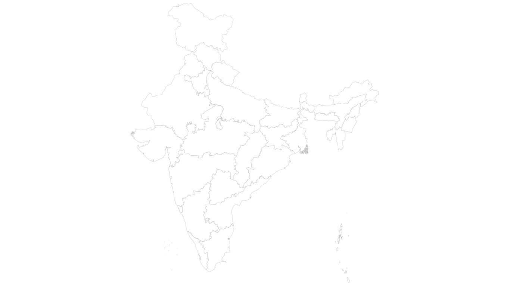

# IndiaD3: Interactive Geospatial Intelligence System

> **A high-performance, vector-based geographical exploration platform built for modern data visualization needs.**



## 📖 Project Overview

**IndiaD3** is an enterprise-grade data visualization system designed to render interactive, high-fidelity maps of India. Leveraging the raw power of **D3.js** and **GeoJSON**, it transforms complex coordinate data into a fluid, 60fps navigable experience.

Unlike static image maps, this project uses **Scalable Vector Graphics (SVG)** to ensure infinite unparalleled clarity at any zoom level, making it ideal for demographic analysis, educational tools, and cultural storytelling.

---

## 🚀 Key Features

### 1. High-Performance Vector Mapping

- **Precision Rendering**: Utilizing `d3.geoMercator()` projection to map GeoJSON coordinate arrays to screen pixels with sub-pixel accuracy.
- **Fluid Interactions**: Implements `d3-zoom` and `d3-drag` for butter-smooth panning and zooming interactions similar to Google Maps.
- **Smart State Selection**: Auto-centering and diverse color-coding logic for active states.

### 2. Intelligent Data Layer

- **Real-Time Search**: Instant state filtering with predictive ease-of-access.
- **Dynamic Data Injection**: A slide-in detail panel that hydration-loads curated data (population, capital, tourist attractions) based on user interaction.
- **Deep-Dive Analytics**: Integration with Vercel Analytics for usage tracking.

### 3. Enterprise UI/UX Design

- **Theme**: "Dark Mode First" aesthetic using deep blues and slate grays (`#0b0f1f`) for reduced eye strain and professional appeal.
- **Glassmorphism**: Modern frosted-glass overlays for floating control panels.
- **Motion Design**: Kinetic animations (`framer-motion` style CSS) for slide-ins, fades, and pulsing indicators.

---

## 🛠 Technical Workflow

This project eschews off-the-shelf map libraries (like Leaflet or Google Maps) in favor of a custom-built rendering pipeline for maximum control.

### The Pipeline: From Data to Pixels

1.  **Ingestion**: Raw geographical data is loaded from `india.geo.json`. This file contains standard RFC 7946 GeoJSON FeatureCollections.
2.  **Projection**: The system applies a **Mercator Projection** mathematics to translate spherical Lat/Long coordinates onto a 2D plane.
    ```js
    const projection = d3.geoMercator().fitSize([width, height], data);
    ```
3.  **Path Generation**: D3's `geoPath` generator converts these projected points into SVG path commands (`M`, `L`, `Z`).
4.  **DOM Binding**: React binds these paths to the Virtual DOM, allowing standard React events (`onClick`, `onMouseEnter`) to drive D3 transitions.
5.  **State Management**: React `useState` tracks the `activeState`, triggering side-effects that update the UI panels and zoom transform.

---

## 🏗 Tech Stack

| Component         | Technology      | Description                                                         |
| :---------------- | :-------------- | :------------------------------------------------------------------ |
| **Core Logic**    | React 19        | Component-based, state-driven UI architecture.                      |
| **Visualization** | D3.js (v7)      | Industry-standard library for manipulating documents based on data. |
| **Styling**       | Tailwind CSS v4 | Utility-first CSS framework for rapid, consistent styling.          |
| **Build Tool**    | Vite            | Next-generation frontend tooling for lightning-fast HMR.            |
| **Data Format**   | GeoJSON         | Open standard format for simple geographical features.              |

---

## ⚡ Quick Start

### Prerequisites

- Node.js > 18.0.0
- NPM or Yarn

### Installation

1.  **Clone the Repository**

    ```bash
    git clone https://github.com/aadi347/KnowMyIndia.git
    cd KnowMyIndia
    ```

2.  **Install Dependencies**

    ```bash
    npm install
    ```

3.  **Run Development Server**
    ```bash
    npm run dev
    ```
    The application will launch at `http://localhost:5173`.

---

## 📂 Project Structure

```
src/
├── components/
│   ├── IndiaMap.jsx        # Core D3 visualization engine
│   ├── StateInfo.jsx       # Main layout and state management
│   ├── StateDetails.jsx    # Right-side information panel
│   ├── FeatureHighlights.jsx # Marketing highlights section
│   └── TechnicalDemo.jsx   # Interactive "How it Works" demo
├── data/
│   └── india.geo.json      # Topographical data source
└── App.jsx                 # Root component
```

---

## 🤝 Contribution

We welcome contributions! Please fork the repository and submit a Pull Request. For major changes, please open an issue first to discuss what you would like to change.

---

<div align="center">
  <p>Built with ❤️ by Aditya Kumar</p>
  <p>
    <a href="https://github.com/aadi347">GitHub</a> • 
  </p>
</div>
